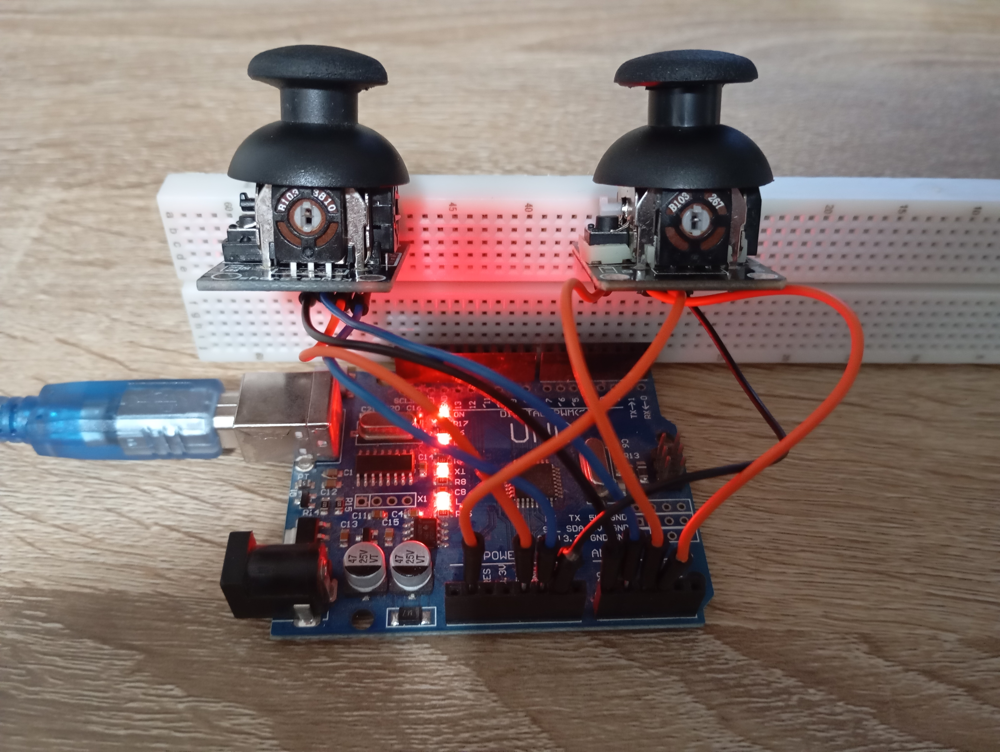

# Arduino stick controler
This project reads joystick input from an Arduino and sends it over serial to a Linux-based controller application, which simulates keyboard or mouse input using X11.



## Features
- Read analog joystick data (2 sticks supported)
- JSON-formatted serial communication from Arduino
- C application on Linux parses the data and moves the mouse or presses keys
- Uses `jansson` for JSON parsing and `X11` for simulating input

### Arduino Side

- Arduino board (e.g., Uno)
- 2 analog joysticks
- ArduinoJson library

#### stick 1 - mouse
- analog pin 1 (x) - A0
- analog pin 2 (y) - A1
- digital pin (button) - 2

#### stick 2 - keys
- analog pin 1 (x) - A2
- analog pin 2 (y) - A3
- digital pin (button) - 3

### Linux Side
- `libjansson-dev`
- `libx11-dev`
- controler_app

You can install required Linux libraries with:
```bash
sudo apt-get install libjansson-dev libx11-dev
```

### Usage
load the `controler.ino` code from the `/controler` directory to the arduino,then run the controler app.
